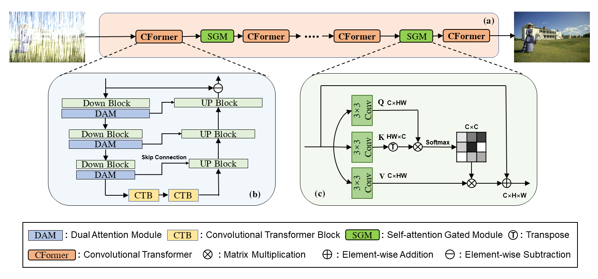
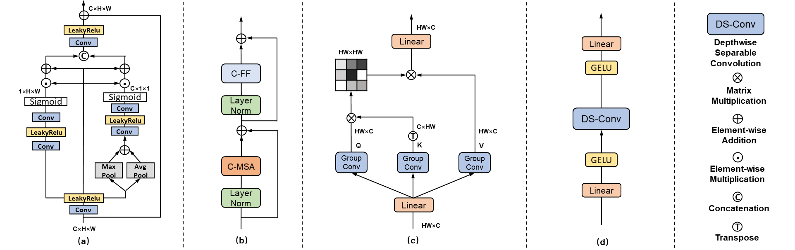

# Progressive Convolutional Transformer for Image Restoration


> **Abstract:** *In the past few years, image restoration tasks have long been dominated by convolutional neural networks (CNNs). However, the deficiency of modeling long-range dependencies due to the local computational property of convolution greatly limits the restoration performance of CNN models. To overcome this limitation, we propose a novel multi-stage progressive convolutional Transformer to recursively restore the degraded images, termed PCformer, which enjoys a high capability for capturing local context and global dependencies with friendly computational cost. Specifically, each stage of PCformer is an asymmetric encoder-decoder network whose bottleneck is built upon a tailored Transformer block with convolution operation added in to avoid any loss of local context. Both encoder and decoder are convolution-based modules, thus allowing to explore rich contextualized information for image recovery. Taking the low-resolution features encoded by the encoder as tokens input into the Transformer bottleneck guarantees that long-range pixel interactions are captured while reducing the computational burden. Meanwhile,  we apply a gated module for filtering redundant information propagation between every two phases. In addition, long-range enhanced inpainting is further introduced to mining the ability of PCformer to exploit distant complementary features. Extensive experiments yield superior results and in particular establishing new state-of-the-art results on eighteen benchmark datasets in terms of quantitative and qualitative evaluation.* 

## Network Architecture
<table>
  <tr>
    <td>  </td>
  </tr>
  <tr>
    <td><p align="center"><b>Overall Framework of PCformer</b></p></td>
  </tr>
   <tr>
    <td>  </td>
  </tr>
    <tr>
    <td><p align="center"> <b>Modules</b></p></td>
  </tr>
</table>


## Installation
The model is built in PyTorch 1.1.0 and tested on Ubuntu 16.04 environment (Python3.7, CUDA9.0, cuDNN7.5).

For installing, follow these intructions
```
conda create -n pytorch1 python=3.7
conda activate pytorch1
conda install pytorch=1.1 torchvision=0.3 cudatoolkit=9.0 -c pytorch
pip install matplotlib scikit-image opencv-python timm einops ptflops PIL argparse
```

## Training and Evaluation

Training and Testing codes for rain streak removal, raindrop removal, gaussian noise removal, real noise removal, haze removal, low-light image enhancement and shadow removal are provided in their respective directories.


